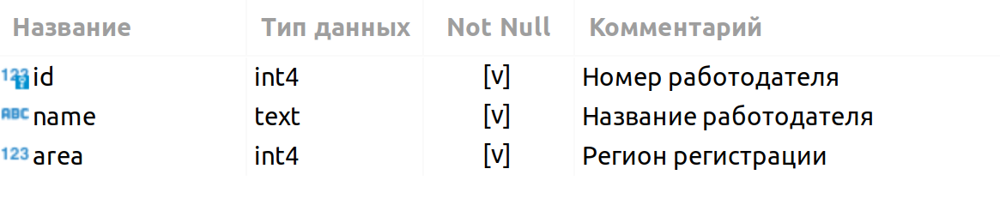

# PROJECT-2. Анализ вакансий из HeadHunter
 

Проект по **анализу данных**(*Data Understanding*) о вакансиях для кадрового агентства. 

***Data Understanding*** - является предваритльным этапом для последующего создания модели машинного обучения, рекомендующей вакансии клиентам агентства, претендующим на позицию Data Scientist.

**Проект включает в себя несколько этапов:**
* знакомство с данными;
* предварительный анализ данных;
* детальный анализ вакансий;
* анализ работодателей;
* предметный анализ.

## Знакомство с данными

База данных представленна данными следующей структуры:

В свою очередь каждая таблица содержит следующие сведения:

### VACANCIES
Таблица хранит в себе данные по вакансиям и содержит следующие столбцы:

**Зарплатная вилка** — это верхняя и нижняя граница оплаты труда в рублях (*зарплаты в других валютах уже переведены в рубли*). Соискателям она показывает, в каком диапазоне компания готова платить сотруднику на этой должности.

### AREAS
Таблица-справочник, которая хранит код региона и его название.

### EMPLOYERS
Таблица-справочник со списком работодателей.

### INDUSTRIES
Таблица-справочник вариантов сфер деятельности работодателей.

### EMPLOYERS_INDUSTRIES
Дополнительная таблица, которая существует *для организации связи между работодателями и сферами их деятельности.*

Необходимость данной таблицы обусловлена тем что у одного работодателя может быть несколько сфер деятельности (или работодатели могут вовсе не указать их). Для удобства анализа необходимо хранить запись по каждой сфере каждого работодателя в отдельной строке таблицы.

