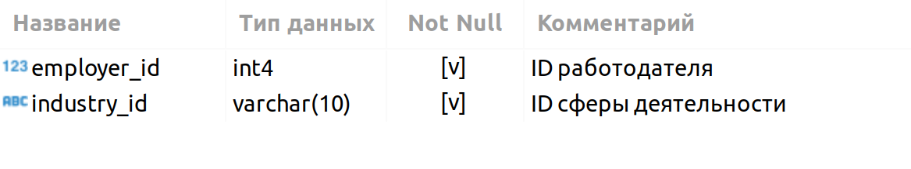

# PROJECT-2. Анализ вакансий из HeadHunter
 

Проект по **анализу данных**(*Data Understanding*) о вакансиях для кадрового агентства. 

***Data Understanding*** - является предваритльным этапом для последующего создания модели машинного обучения, рекомендующей вакансии клиентам агентства, претендующим на позицию Data Scientist.

**Проект включает в себя несколько этапов:**
* знакомство с данными;
* предварительный анализ данных;
* детальный анализ вакансий;
* анализ работодателей;
* предметный анализ.

## Знакомство с данными

База данных представленна данными следующей структуры:

В свою очередь каждая таблица содержит следующие сведения:

### VACANCIES
Таблица хранит в себе данные по вакансиям и содержит следующие столбцы:

**Зарплатная вилка** — это верхняя и нижняя граница оплаты труда в рублях (*зарплаты в других валютах уже переведены в рубли*). Соискателям она показывает, в каком диапазоне компания готова платить сотруднику на этой должности.

### AREAS
Таблица-справочник, которая хранит код региона и его название.

### EMPLOYERS
Таблица-справочник со списком работодателей.

### INDUSTRIES
Таблица-справочник вариантов сфер деятельности работодателей.

### EMPLOYERS_INDUSTRIES
Дополнительная таблица, которая существует *для организации связи между работодателями и сферами их деятельности.*

Необходимость данной таблицы обусловлена тем что у одного работодателя может быть несколько сфер деятельности (или работодатели могут вовсе не указать их). Для удобства анализа необходимо хранить запись по каждой сфере каждого работодателя в отдельной строке таблицы.

## Предварительный анализ данных
Предварительный наализ данных показал количественные характеристики: 
* Общее количество вакансий в базе: **49197**
* Общее количество работодателей в базе: **23501**
* Общее количество регионов в базе: **1362**
* Общее количество сфер деятельности в базе: **294**

База обширная. Разнородная. Для значимых выводов пока рано

## Детальный анализ вакансий
**Детальный наализ вакансий показал:**
* Значение средних нижних и верхних границ "вилки" предлагаемых вакансий от 71 до 110 тысяч рублей;
* проведени дополнительные исследования в разрезе опыта и в разрезе региона
* Подавляющее число вакансий требует опыт работы от 1 года до 6 лет

**Интересные выводы и наблюдения:**
* Подавляющее количество работодателей **ищут работников на основное место работы**, и не заинтересованы в совместительстве;
* Чуть более половины всех вакансий имеют пустые отметки о предлагаемой ЗП;
* Получено распределение среднего уровня ЗП по городам-миллионникам (подробные выводы в ноутбуке-шаблоне)

## Анализ работодателей
 
**Анализ работодателей показал:**

* В топе по количеству вакансий технолочичные компании:такие как Яндекс, Ростелеком, СБЕР 

* Доля IT компаний на HH.ru составляет 15% что является существенной долей в структуре клиентов компании (HH.ru), что обязывает учитывать интиресы индустирии (IT) и при работе, развитии сервиса.

* Яндекс раскинул свои щупальца по всей стране(России). 93% вакансий  Яндекса в России. Российские вакансии распределены по городам-миллионикам(27%), крупным городам до 1 млн.чел (26%),крупным городам до 500 тыс.чел.(23%), большим городам (23%). В средних городах 1 % 

## Предметный анализ

**Предметный анализ показал :**

* Есть вакансии для Дата-саентиста без опыта

* Вакансии для Дата-саентиста с опытом до одного года отсутствуют в базе не представлены

* За первый год рабыты ЗП Дата-саентиста может вырасти почти в два раза. 

* Дата саентист должен обдадать комплексными знаниями и навыками и уметь сопрягать их.

* Среди ключевых навыков Python (20%) практически в 2 раза востребованее чем SQL или postgres (11%)

## Большой вопрос
Почему около половины вакансий не имеют данных о ЗП?

Гипотезы по ответу на вышеуказанный вопрос представлены в ноутбуке-шаблоне в выводах по разделам и в общем выводе.

## Использованные инструменты и библиотеки:
* **pandas** (2.2.1)
* **psycopg2** (2.9.9)
* **plotly** (5.18.0)
* **urllib3** (1.26.5)

